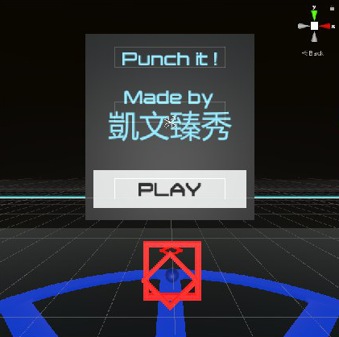

# Punchit

**108 學年度「元智大學 AR/VR 競賽其他組」**

**組員: 林俐秀、許巧臻、李文鈺、方凱柔**

**指導老師: 葉奕成**

## 作品發想
* 當初玩Cytus玩得很盡興，但覺得這樣僅侷限於2D螢幕上而已，不夠過癮。
* 現在市面上VR類的音樂遊戲不多，所以便有了想自己設計一款能結合VR實境的遊戲的想法，讓人遊玩時彷彿真的置身於音樂世界中。
* 除此之外，為了增加遊戲趣味，我們還想出了各種遊戲效果或打法，像是有拉長音的部分、連擊等等。
* 遊玩時，也可以透過VR實境技術讓玩家看見迎面而來的特效，給予滿滿的回饋感。

## 作品說明
* 玩家戴上VR眼鏡後，對於眼前出現的球，跟著音樂的節奏進行打擊，亦有長音的部分需跟著預設軌跡移動的方式進行。
* 由於遊戲空間為360度，所以球有可能從玩家的各方向出現。
* 玩家可利用屏幕上的特殊效果辨識球出現的方向，得知後方有球。
* 在遊戲結束後，玩家會獲得分數與評分等級。

## 作品特色
* 有效利用360度空間，增加遊戲範圍
* 利用螢幕特殊效果來提醒玩家打擊方向
* 打擊特效的出現，讓玩家收穫滿滿的回饋感
* 玩家可以邊享受音樂邊進行運動，在室內的環境也能暢快體驗
* 豐富精采的打法，增加遊戲樂趣
